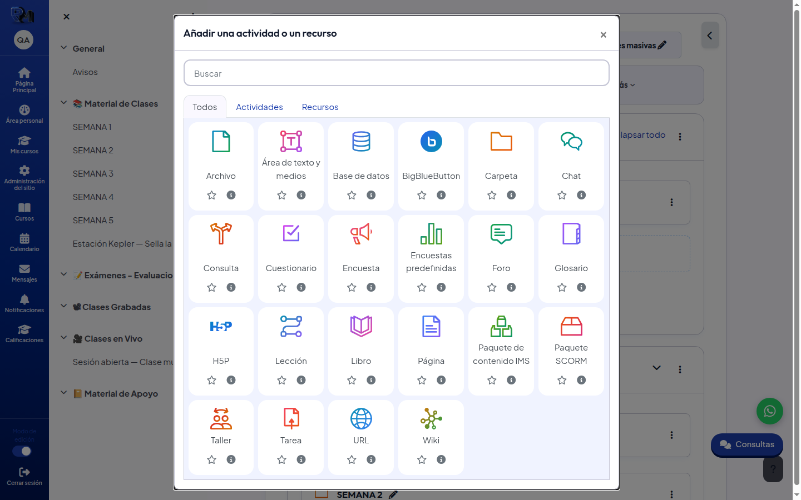
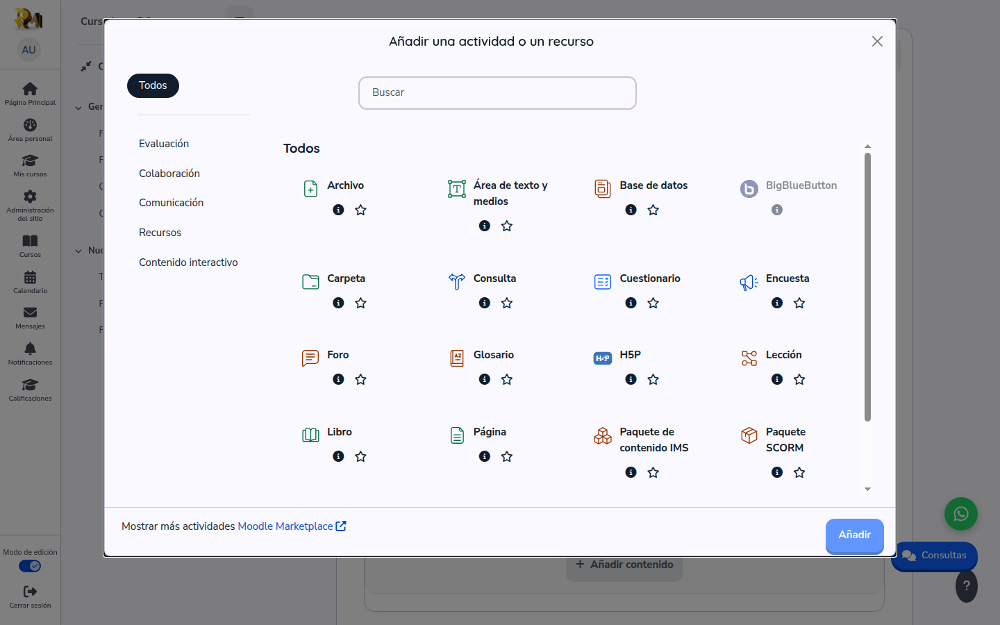
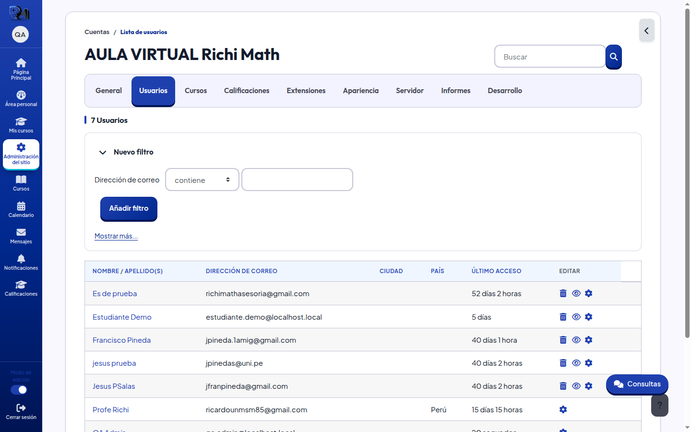
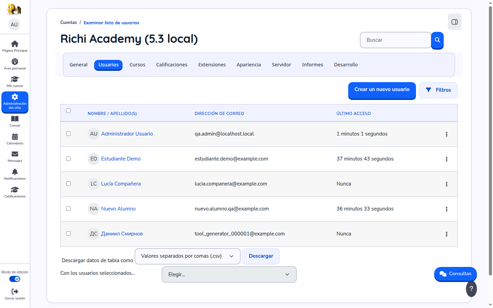

# Dos decisiones para Richi antes de cerrar la Fase 1

Todo lo demás de la Fase 1 ya funciona en 5.3. Estas dos cosas no se pueden
«portar» sin más: Moodle 5.3 trae su propia versión de lo que hicimos en 4.3, y
hay que elegir cuál se queda.

Capturas del 2026-10-09, entorno local, mismo usuario administrador.

---

## MIG-27 · Iconos de actividad

En 4.3 Richi pidió los iconos «con el diseño de Moodle, sin fondo extra y con
colores vivos». Los hicimos nosotros (un degradado de color por módulo).
**Moodle 5.3 ya los trae así de serie**: dibujos nuevos, en color, sin baldosa,
un color por tipo de actividad, y además funcionan en modo oscuro.

| 4.3 — los nuestros | 5.3 — los de Moodle |
|---|---|
|  |  |

**Opciones**

- **(a) Quedarse con los de Moodle 5.3.** Cero mantenimiento: cada
  actualización de Moodle los mejora sola. Los colores se pueden ajustar a la
  paleta de cada nivel sin redibujar nada.
- **(b) Volver a los nuestros.** Hay que adaptar el script a los dibujos nuevos
  de 5.3 (traen el color incrustado) y desactivar el coloreado de Moodle. Habrá
  que repetirlo en cada actualización.

**Recomendación: (a).** Cumple lo que pidió Richi y no deja trabajo pendiente.

Nota: en la captura de 5.3 se ve que **el selector de actividades entero es
nuevo** (categorías a la izquierda, lista, botón «Añadir»). No es algo nuestro
y no se toca.

---

## MIG-26 · Lista de usuarios del admin

En 4.3 Richi pidió: título «Lista de usuarios», filtro por **correo** a mano y
la página más legible. Lo hicimos sobre el formulario de filtros de 4.3.
**En 5.3 esa página es otra**: un informe con columna de correo, un botón
«Filtros» y descarga a CSV.

| 4.3 — la nuestra | 5.3 — la de Moodle |
|---|---|
|  |  |

**Opciones**

- **(a) Aceptar la de Moodle 5.3 tal cual.** Ya muestra el correo de cada
  usuario y se filtra por correo desde «Filtros». Solo cambiaría el título
  («Examinar lista de usuarios» → «Lista de usuarios»), que se hace con la
  personalización de idioma, sin código.
- **(b) Adaptarla.** Abrir «Filtros» con el correo ya elegido y retocar el
  aspecto. Es código nuevo sobre un informe de Moodle que cambia de versión en
  versión.

**Recomendación: (a)** más el cambio de título.

---

## Qué pasa mientras Richi decide

Nada se bloquea: la Fase 2 (ensayo con la copia de producción) puede empezar.
Mientras tanto, 5.3 usa los iconos y la lista de usuarios de Moodle.
